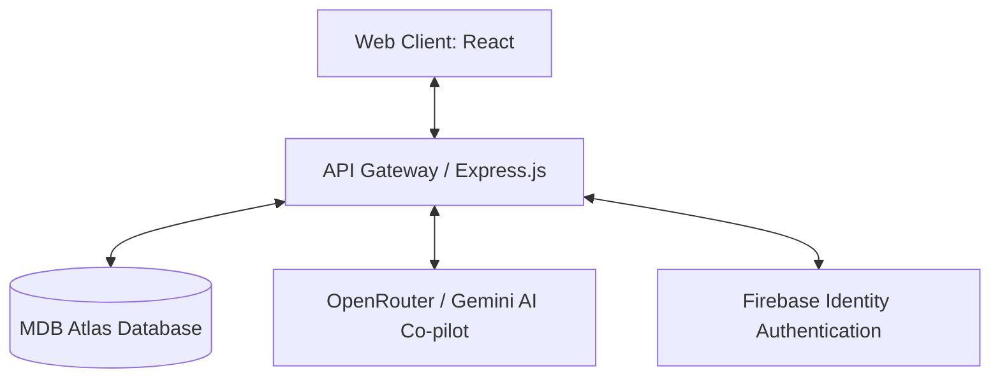

# Nexus Career OS 🚀

> Unified Career Co-pilot and ATS Resume Automator.

[]()
[]()
[]()
[]()

Nexus Career OS is a unified co-pilot platform that consolidates user profile management, resume compilation, and skill assessment. Unlike fragmented tools, Nexus uses a single, database-backed profile as the source of truth to automate resume generation, mock interviews, and skill gap audits.

---

## 🌟 Key Features
- **Smart Profile Core**: One-time profile builder tracking skills, experience, and projects.
- **ATS Resume Builder**: One-click tailored resumes generated using only verified profile data.
- **Skill Gap Analyzer**: Side-by-side keyword matching comparing current skills against target roles.
- **Failover AI Gateway**: OpenRouter failover routing chain linking Llama 3.1 and Gemini 3.5.

---

## 🏗 System Architecture


---

## ⚙ Installation & Setup

1. **Clone the repository**:
   ```bash
   git clone https://github.com/malyalamounika051-bit/nexsus.career.os.git
   cd nexsus.career.os
   ```

2. **Backend Setup**:
   ```bash
   cd backend
   npm install
   npm run dev
   ```

3. **Frontend Setup**:
   ```bash
   cd ../frontend
   npm install
   npm run dev
   ```

---

## 📄 License
This project is licensed under the MIT License — see the [LICENSE](LICENSE) file for details.
