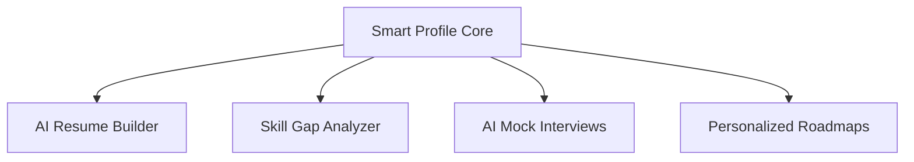

# Product Requirement Document (PRD): Nexus Career OS

## 1. Executive Summary
Nexus Career OS is a comprehensive AI-powered career co-pilot designed to streamline, guide, and accelerate the transition from student to employed professional. By offering a central "Smart Profile" single source of truth, it feeds resume generation, AI mock interviews, career roadmapping, and skill gap analyses to automate the job search lifecycle.

## 2. Vision & Business Goal
- **Vision**: Eliminate manual duplicate data entry in recruitment prep. Build a system where a single verified profile drives resume building, tailoring, interview practice, and gap analysis instantly.
- **Business Goal**: Empower job seekers to increase application response rates by 3x and compress job preparation cycles by 60%.

## 3. Target Audience & Pain Points
- **Audience**: College graduates, junior engineers, career switchers.
- **Pain Points**:
  - Repetitive copy-pasting of profile details on dozens of resume variations.
  - Recruiter mismatch due to lack of optimized ATS keywords.
  - Blind spots concerning required technical skills vs current profile capabilities.

## 4. Functional Requirements & Feature Priorities

| Priority | Feature Area | Description | Acceptance Criteria |
| --- | --- | --- | --- |
| P0 | Master Profile | Central form with database sync for Education, Skills, Projects, and Experience | Autosaves to DB, pre-fills downstream applications. |
| P0 | Profile-Driven Resume | Auto-compiles verified profile data to ATS templates based on job description | Zero hallucinated skills allowed in the outputs. |
| P1 | Skill Gap Analyzer | Compares job requirements vs user profile skills in real-time | Lists matching vs missing; ranks recommendations. |
| P1 | Interactive Templates | Render 7 professional CSS templates dynamically with zoom control | PDF export maps exactly 1-to-1 without text clipping. |

## 5. Success Metrics & KPIs
- **ATS Match Score Optimization**: User resumes average >80% compatibility rating post-AI matching.
- **Engagement Conversion**: Over 85% of registered users complete their master profiles to >=60% completion rate.
- **System Latency**: Resume tailoring AI queries resolve within <6 seconds on the server.
