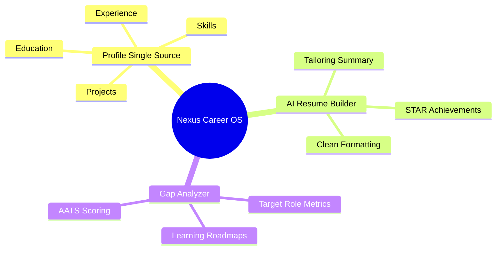

# Executive Summary: Nexus Career OS

## Purpose
This document provides a high-level summary of the Nexus Career OS platform, capturing the core business rationale, technical innovation, and product execution strategy for key stakeholders, judges, and investors.

## Overview
Nexus Career OS is a unified co-pilot platform that consolidates user profile management, resume compilation, and skill assessment. Unlike fragmented tools that require manual copy-pasting, Nexus uses a single, database-backed profile as the source of truth to automate resume generation, mock interviews, and skill gap audits.

## Key Highlights
- **Product Definition**: An all-in-one Career OS for modern job seekers.
- **Unique Selling Proposition (USP)**: Single-profile synchronization that feeds all downstream recruitment systems without data replication or hallucination.
- **Value Metric**: Replaces hours of manual preparation with 1-click ATS resume generation.

