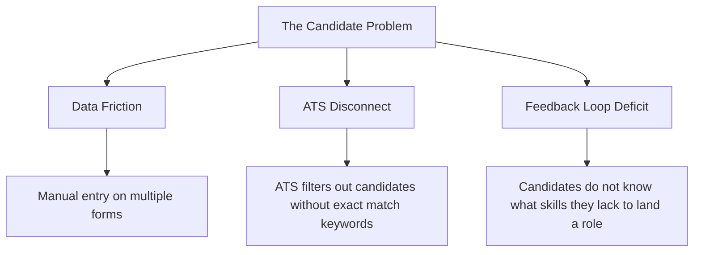

# Problem Statement: The Recruitment Friction

## Purpose
Establishes the core problem area Nexus Career OS addresses: structural inefficiency and information asymmetry in entry-level tech hiring.

## Overview
Applying for junior jobs is a broken process. Job seekers are forced to repeatedly build custom resumes, guess what keywords ATS parsers want, and manually practice mock interviews without realistic, tailored feedback. 

## Key Core Problems

- **Manual Data Replication**: Candidates spend up to 4 hours per application rewriting projects to match JD descriptions.
- **The ATS Filter Wall**: Automated filters discard up to 75% of qualified resumes because of subtle keyword differences.
- **Skill Invisibility**: Job seekers do not know exactly why they are rejected, leaving them blind to their true skill gaps.
