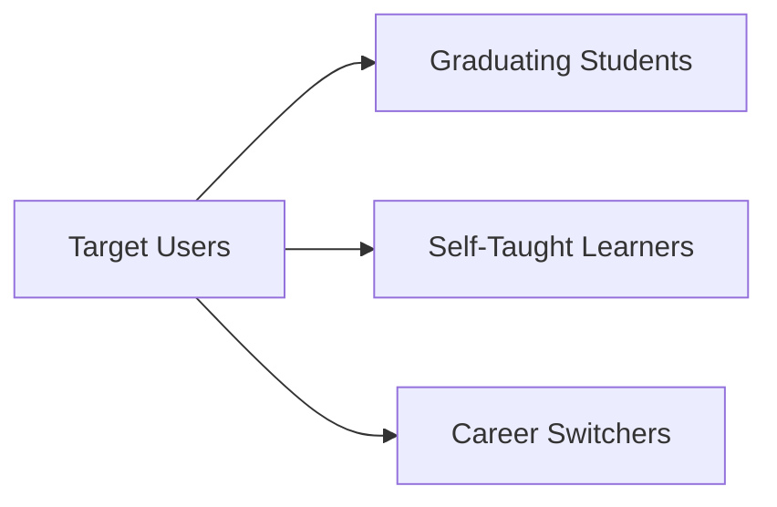

# Target Users: Segments & Needs

## Purpose
Identifies the primary user groups of Nexus Career OS and their core behavioral profiles.

## User Segments

### 1. Graduating Tech Students
- **Context**: Pursuing computer science or tech degrees, entering the job market for the first time.
- **Goal**: Highlight internships and academic projects effectively without professional experience.

### 2. Bootcamps & Self-Taught Developers
- **Context**: Transitioning from non-traditional paths.
- **Goal**: Validate skills, construct portfolio resumes, and prove industry readiness.

### 3. Professional Career Switchers
- **Context**: Moving into tech from sales, finance, or business roles.
- **Goal**: Reframe past experiences into transferable technical outcomes.
