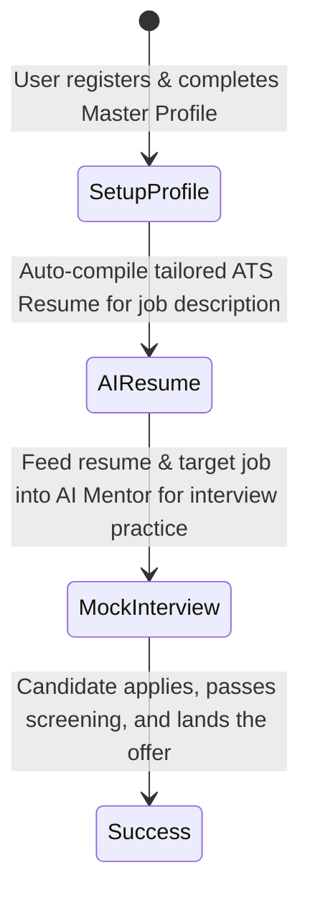

# User Journey: Landing the Job

## Purpose
Maps the step-by-step product interaction flow from signup to employment.

## The 4-Stage Journey

### Stage 1: Setup Profile (The Single Source of Truth)
- **User Actions**: Signs up, manually enters details or uploads existing resume PDF. Auto-merges and validates profile sections.
- **System Output**: Stores structured documents in MongoDB. Computes profile completion score.

### Stage 2: Target & Tailor (Resume Generation)
- **User Actions**: Opens Resume Builder, enters job description.
- **System Output**: Generates customized summary and experience bullet points using only profile data. Displays real-time skill gaps.

### Stage 3: Practice & Refine (AI Co-pilot)
- **User Actions**: Practices mock technical questions curated from the target role requirements.
- **System Output**: Scores answers and offers guidance via SARA AI Mentor.
