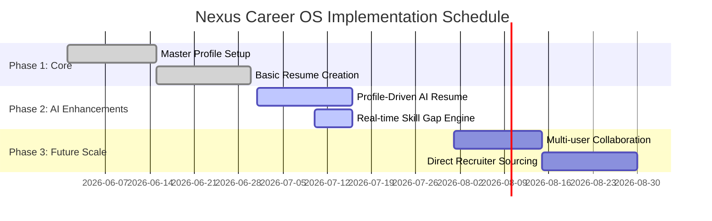

# Product Roadmap: Implementation Phases

## Purpose
Visualizes the release sequence and technical feature implementation milestones.

## Milestone Definitions
- **Milestone 1 (Core)**: CRUD operations operational for user profile and basic resume builder.
- **Milestone 2 (AI Upgrade)**: Integration of Gemini AI for tailored resumes, STAR achievements, and interactive skill gap visualization (completed for Demo Day).
- **Milestone 3 (Scale)**: Auto-matching with active job boards and automated email application draft co-pilots.
