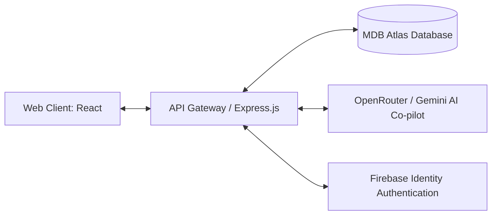

# System Architecture: Nexus Career OS

## Purpose
Detailed technical mapping of the system's software components, data flows, and infrastructure environments.

## Architecture Diagram

## Infrastructure Configuration
- **Client Hosting**: Vercel Edge Serverless hosting (React, SPA, dynamic state caching).
- **Backend API**: Node.js/Express.js deployed on Vercel serverless environment.
- **Database Layer**: MongoDB Atlas cluster with active database pooling and Mongoose schemas.
- **AI Gateway**: OpenRouter failover routing chain linking Llama 3.1 70B Instruct / Gemini 3.5 formats.
- **Security Protocols**: SSL/TLS encryption, JWT authentication verification, CORS constraints.
