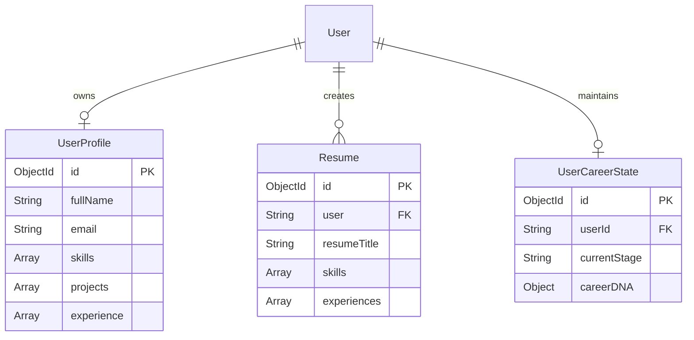

# Database Design: Collection Schemas & Relationships

## Purpose
Specifies MongoDB collections, structural validation metrics, and active indexing properties.

## ER Diagram

## Schema Definitions & Indexes

### Collection: `UserProfiles`
- **Unique Indexes**: `{ user: 1 }` (Ensures single profile source of truth).
- **Structure**: Tracks verified skills, experiences, and project subdocuments (incorporating AI-enhanced STAR bullets).

### Collection: `Resumes`
- **Sparse Indexes**: `{ shareableToken: 1 }` (For public resume sharing).
- **Structure**: Pre-compiled resumes tailored for target job postings.
