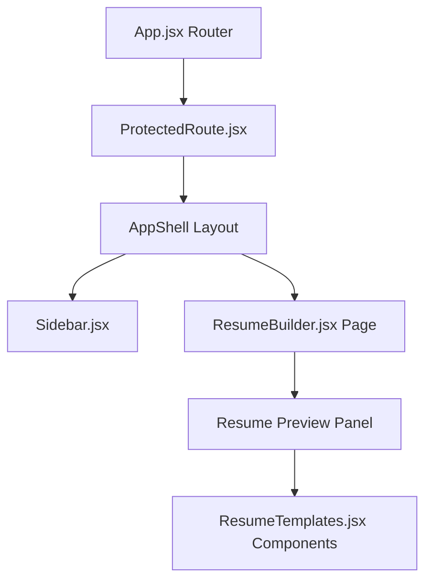

# Frontend Architecture: React & Interactive Preview

## Purpose
Details the technical design of the web client application, state management, and template styling.

## Component Tree

## Core Modules & State
- **State Engine**: React Hooks (`useState`, `useEffect`) driving clean data propagation from profile cache.
- **Routing Module**: `react-router-dom` implementing client routing, protected directories, and public shareable routes.
- **Preview Engine**: Scale calculations dynamically rendering customized CSS templates (Glacier Chill, Sahara Contrast) using standard A4 sizing rules (794px width, 1123px height). Exporting translates SVG/HTML nodes to standard files using `html2pdf.js`.
- **UI Framework**: Vanilla CSS tokens incorporating standard variables for surface layers, active shadows, and transition metrics.
