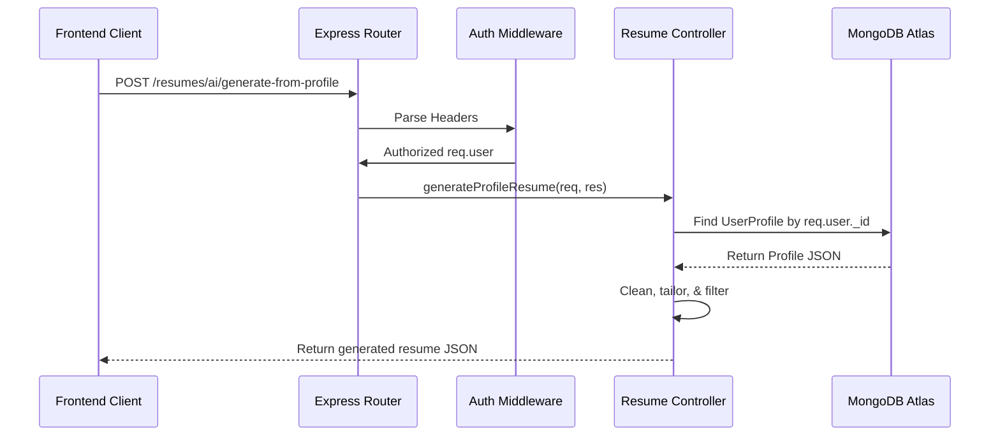

# Backend Architecture: Express & Database Pooling

## Purpose
Details the design of the Express.js REST API gateway, database pooling, and middleware integrations.

## Router Layout & Controller Actions
- **Authentication**: `authMiddleware.js` parses Firebase headers or standard JWT tokens, populating `req.user`.
- **Database Connection Manager**: `db.js` implements serverless-friendly promise-level caching (preventing multiple Mongoose connection instantiations on concurrent Vercel requests).
- **Service Interfaces**: Endpoints leverage helper methods to call LLMs and validate structured outputs.

