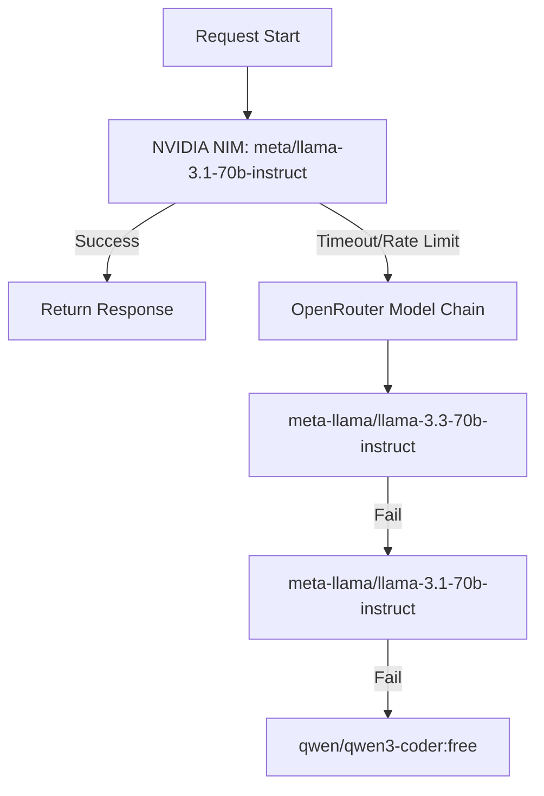

# AI Module: LLM Prompts & Failover Gates

## Purpose
Examines prompt strategies, JSON parser recovery methods, and LLM orchestration routing.

## Model Failover Routing
The system routes requests using `geminiClient.js` with failover fallbacks:


## JSON Sanitization Gate
Because LLM outputs can include markdown formatting or leading/trailing commas, the system uses a custom parser (`jsonParser.js`):
1. **Markdown Stripper**: Regex searches for ` ```json ... ``` ` blocks.
2. **Object Extractor**: Finds first occurrence of `{` and walks brackets to capture the inner structure.
3. **Syntax Cleaner**: Normalizes smart quotes and removes trailing commas before invoking JSON parse.
4. **Validation Filter**: Controller filters properties against profile data to prevent hallucinated achievements or unverified skills.
