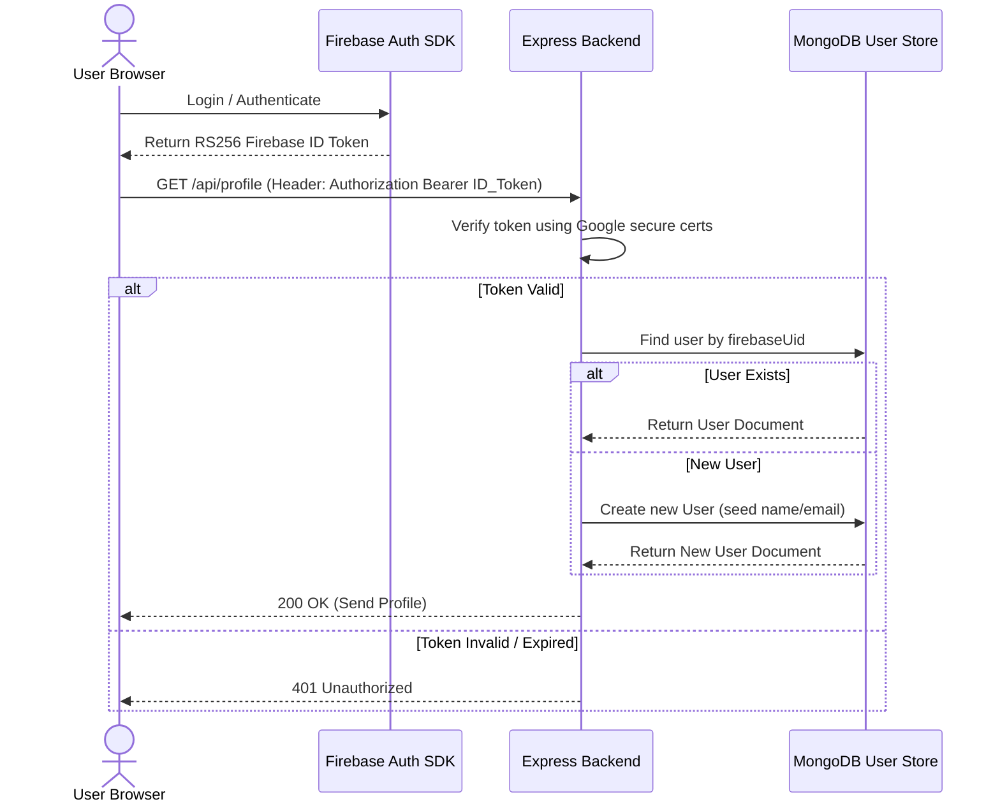

# Authentication Flow: Firebase & Local Handshake

## Purpose
Examines the token verification sequence and user validation mechanics.

## Authentication Sequence

```mermaid
sequenceDiagram
    actor User as User Browser
    participant FB as Firebase Auth SDK
    participant BE as Express Backend
    participant DB as MongoDB User Store

    User->>FB: Login / Authenticate
    FB-->>User: Return RS256 Firebase ID Token
    User->>BE: GET /api/profile (Header: Authorization Bearer ID_Token)
    BE->>BE: Verify token using Google secure certs
    alt Token Valid
        BE->>DB: Find user by firebaseUid
        alt User Exists
            DB-->>BE: Return User Document
        else New User
            BE->>DB: Create new User (seed name/email)
            DB-->>BE: Return New User Document
        end
        BE-->>User: 200 OK (Send Profile)
    else Token Invalid / Expired
        BE-->>User: 401 Unauthorized
    end
```
