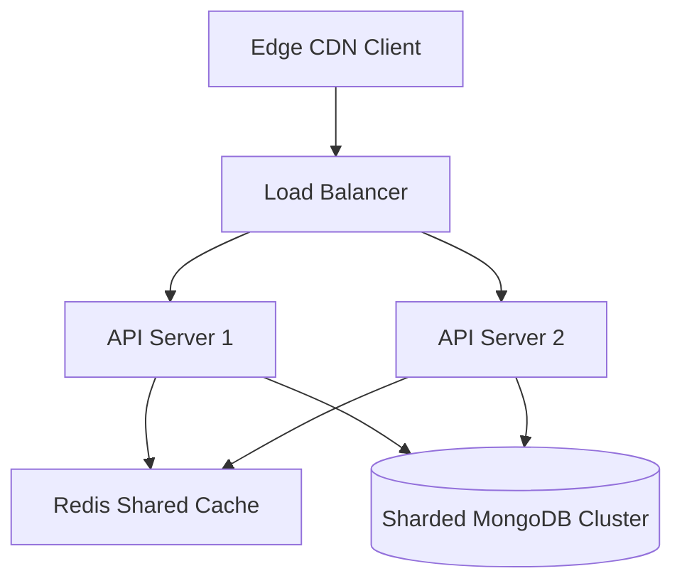

# Scalability Planning: Infrastructure for Growth

## Purpose
Engineering roadmap for scaling the system to support thousands of concurrent users.

## Scaling Architecture

## Operations Plan
- **Database Sharding**: Partition MongoDB data by `user` ID, dividing document writes across active database shards.
- **Failover Routing**: OpenRouter handles API key limits, dynamically switching to alternative LLM backends if rate limits are reached.
- **Stateless Controllers**: Deployed backend functions are stateless, allowing them to scale horizontally across serverless environments.
- **Blob Storage Strategy**: Resume documents and user profile assets are stored in external object storage, keeping main database document sizes small.
