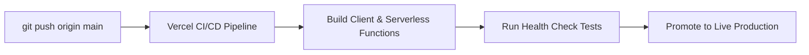

# Deployment Manual & CI/CD Pipeline

## Purpose
Guide for deploying frontend client bundles and API services to production environments.

## Deployment Pipeline

## Required Environment Variables

| Variable Name | Description | Example / Format |
| --- | --- | --- |
| `JWT_SECRET` | Secret key for local token sign/verify operations | `32_character_hex_string` |
| `MONGO_URI` | Base64 encoded MongoDB Atlas connection string | `base64_encoded_string` |
| `OPENROUTER_API_KEY` | OpenRouter access token | `sk-or-v1-...` |
| `FIREBASE_PROJECT_ID` | Project identifier for Firebase OAuth checks | `nexus-os-...` |
| `NVIDIA_API_KEY` | NVIDIA NIM failover API access token | `nvapi-...` |
