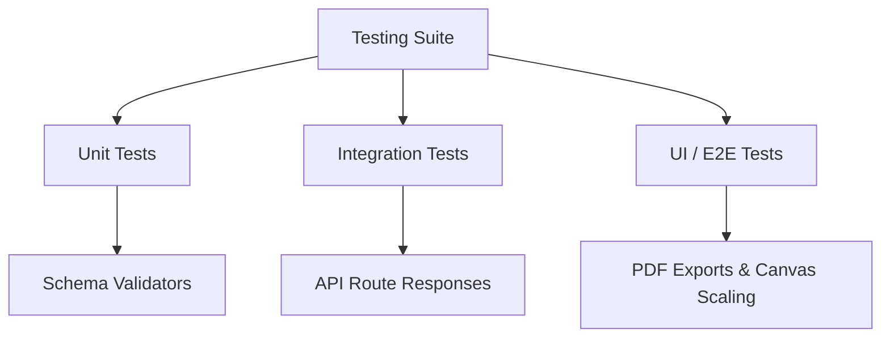

# Quality Assurance & Testing Strategy

## Purpose
Specifies testing methods, edge cases, and automated validation tests.

## Testing Architecture

## Test Areas

### 1. Schema Validation Tests
- **Target**: Confirm Mongoose schema properties validate correctly.
- **Verification**: Ensure saving arrays in string fields (like `desc`) fails validation, and sanitizers successfully convert them before saving.

### 2. API Integration Tests
- **Target**: Test auth middlewares and routing behavior.
- **Verification**: Ensure requests without tokens receive a `401 Unauthorized` response.

### 3. UI Template Visual Tests
- **Target**: Confirm template layout compilation.
- **Verification**: Verify that scaling modifiers match target dimensions (794px by 1123px) across zoom levels.
