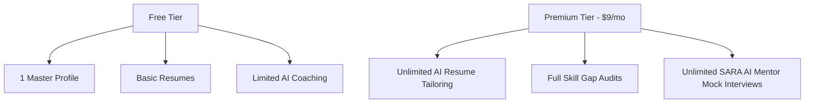

# Business Model: Monetization & Value Proposition

## Purpose
Examines pricing structures, SaaS tier distributions, and operational costs.

## Monetization Plan
Nexus Career OS is built on a freemium model with targeted premium tiers:

- **Enterprise B2B Tier**: Partner with universities and bootcamps to provide bulk licenses for graduating cohorts. This provides an institutional revenue stream while lowering user acquisition costs.
